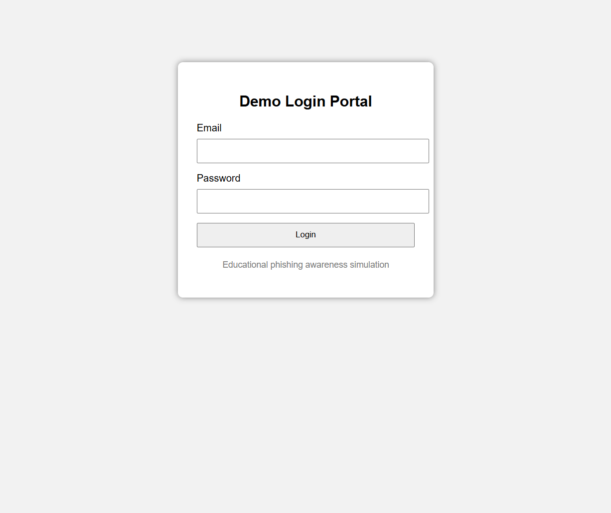
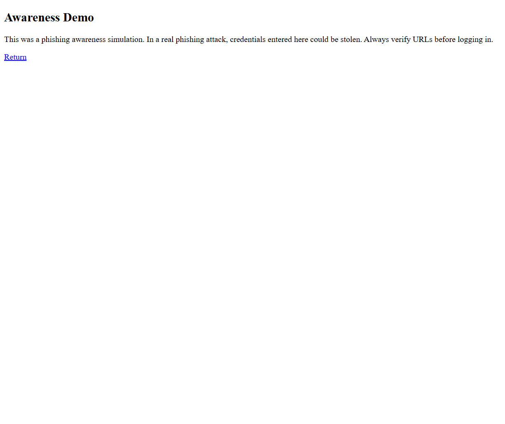

# Phishing Awareness Simulation

A beginner cybersecurity project I built using Python and Flask to understand how phishing pages imitate real login portals and how awareness training can help people recognize these attacks.

This project is a simulation for education only and runs locally on localhost.

## Why I Built This
I wanted hands-on practice with social engineering concepts, not just read about phishing attacks in theory.

This project helped me explore:
- How phishing pages mimic legitimate websites
- How user input can be targeted in phishing attacks
- Why awareness training matters
- Basic Flask web development

## Features
- Simulated login portal
- Educational phishing awareness demo
- Displays awareness warning after form submission
- Logs demo submissions locally for testing
- Runs only on localhost

## Technologies Used
- Python
- Flask
- HTML/CSS
- Basic file handling

## Project Structure

```text
basic-phishing-simulation/
├── app.py
├── demo_submissions.txt
├── templates/
│   ├── login.html
│   └── result.html
├── screenshots/
└── README.md
```

## How To Run

Install Flask:

```bash
pip install flask
```

Run:

```bash
python app.py
```

Open in browser:

```text
http://127.0.0.1:8000
```

## Screenshots

Login simulation:



Awareness result:



## How It Works
1. User enters demo credentials into the simulated portal  
2. Flask processes the form submission  
3. User is shown an awareness message explaining phishing risk  
4. Demo input is logged locally for educational purposes  

## What I Learned
Building this project helped me understand:
- Basic phishing mechanics
- Social engineering risks
- User awareness concepts
- Flask routing and form handling

## Future Improvements
Possible upgrades:
- Phishing detection awareness quiz
- Email phishing examples
- Security awareness training module

## Disclaimer
This project is built only for educational and authorized awareness demonstrations.

It is not intended for credential harvesting or malicious use.